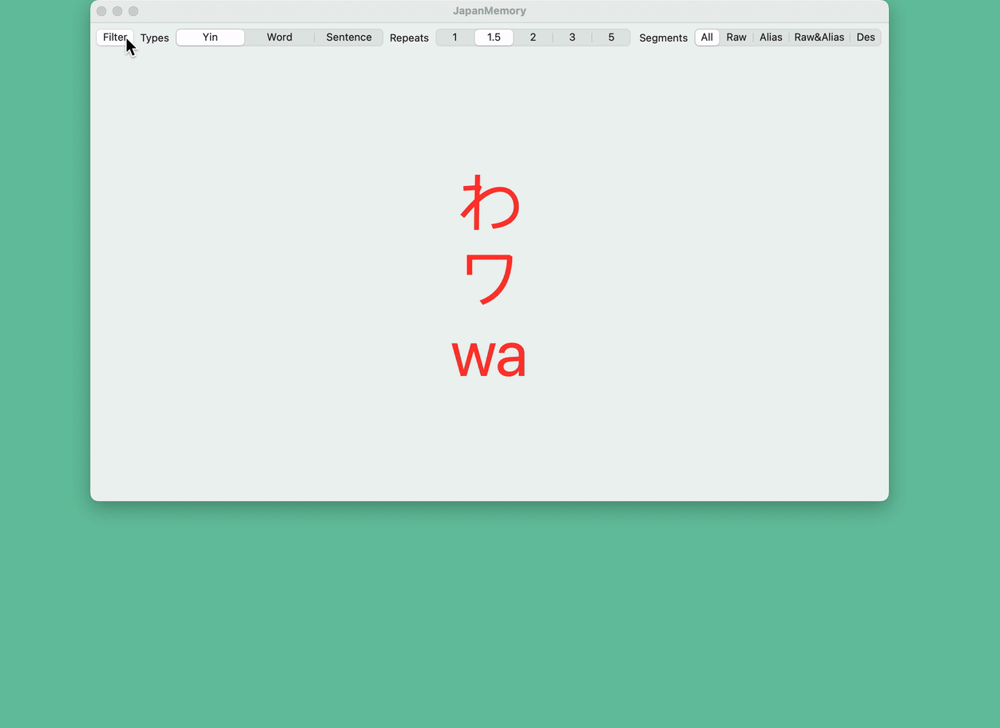

# 日本语速记

刚开始学习日语，五十音图总是记不住。于是想到了把记不住的音定时循环随机展示，以加强记忆，效果良好。

## Screenshot




## Config

打开 app 后，会生成 `~/.config/JapanMemory/config.json` 配置文件。修改该文件可进行单词等内容的自定义补充。（若 app 中修改了配置，也会同步到该文件中。）
> 若 json 配置错误，打开 app 后解析失败，会把错误的 `config.json` 复制为 `config_back.json`，注意查看 app 弹窗信息。

```
{
  "10_type_sel" : "Yin", // 必填。仅可配置 "Yin", "Word", "Sentence" 三个选项。分别表示：五十音图、单词、句子。
  "20_repeat_sel" : 1.5, // 必填。repeats 列表中的一项。
  "21_repeats" : [ 1, 1.5, 2, 3, 5 ], // 必填。自定义播放间隔列表。
  "30_segment_sel" : "Raw&Alias", // 必填。仅可配置 "All", "Raw", "Alias", "Raw&Alias", "Des" 五个选项。展示内容是 items 列表中的配置项。
  "40_yin_items" : [ // 五十音列表
    {
      "10_raw" : "あ",     // 必填。
      "20_alias" : "ア",   // 默认空
      "30_des" : "a",     // 默认空
      "40_filted" : true  // 默认 false，true 表示过滤，循环播放中不会展示。
    },
    {
      "10_raw" : "ん",
      "20_alias" : "ン",
      "30_des" : "h",
      "40_filted" : false
    }
  ],
  "50_word_items" : [ // 单词列表
    {
      "10_raw" : "こんにちは",
      "20_alias" : "Konnichiwa",
      "30_des" : "你好",
      "40_filted" : true
    }
  ],
  "60_sentence_items" : [ // 句子列表
    {
      "10_raw" : "今日は本当にいい天気ですね。そうじゃないですか。",
      "20_alias" : "",
      "30_des" : "今天天气真不错，不是吗？",
      "40_filted" : true
    },
  ]
}
```

## Next

* [ok]通过配置文件，可外部动态配置待记忆内容
* [ok]增加单词记忆
